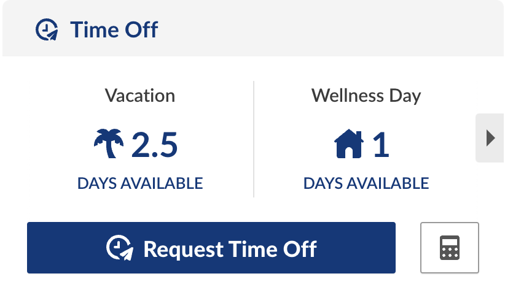
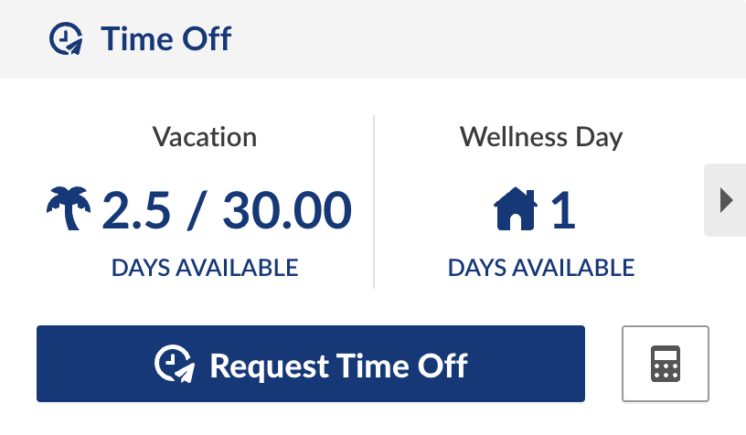

# BambooHR

> For [BambooHR](https://www.bamboohr.com)

## Features

### Display the full available vacation days

| Before | After |
|--------|--|
|  |  |

## Install

1. Install [Violentmonkey](https://violentmonkey.github.io/) or [Tampermonkey](https://www.tampermonkey.net)
2. Install [this userscript](https://github.com/gutenye/userscripts/raw/main/BambooHR/BambooHR.user.js)